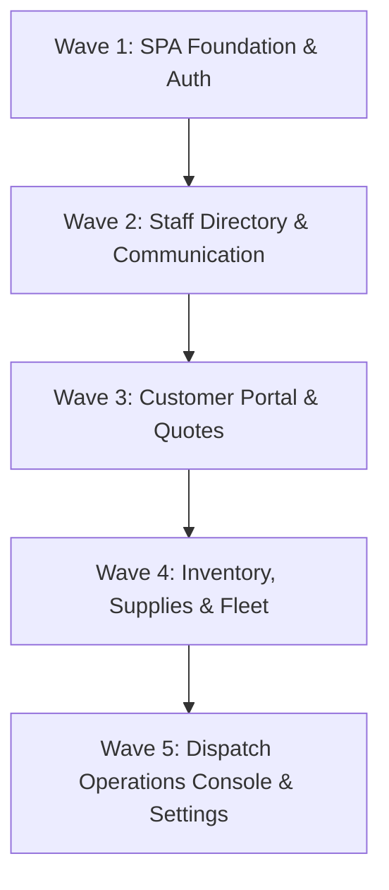

# Firehouse Movers — Frontend Pages Inventory

> **Document Status:** Complete Legacy Django Template & Page Inventory  
> **Total Pages/Templates:** 339 HTML templates across 15 modules  
> **Target Architecture:** React + TypeScript SPA (`/app/*`) communicating with Django REST API (`/api/v1/*`)

---

## Executive Summary

The legacy Firehouse Movers Django codebase contains **339 HTML templates** across **15 distinct domain modules**. This inventory categorizes every user-facing page, form, dashboard, and partial component into logical functional areas to guide the React SPA migration.

---

## 1. Authentication & Staff Management (`authentication`)

**Total Templates:** 24  
**Primary Purpose:** User sign-in, password recovery, profile management, department configuration, employee directory, and onboarding quizzes.

| Legacy Template | Page Title / Purpose | Target React SPA Route |
| --- | --- | --- |
| `login.html` | User Login Screen | `/app/login` |
| `signup.html` | Staff Registration / Signup | `/app/signup` |
| `password_reset_form.html` | Request Password Reset | `/app/password-reset` |
| `password_reset_confirm.html` | Confirm New Password | `/app/password-reset/confirm` |
| `people.html` | Staff & Employee Directory | `/app/people` |
| `profile.html` / `view_profile.html` | My Profile & Account Settings | `/app/profile` |
| `change_password.html` | Change Account Password | `/app/profile/security` |
| `manage_employees.html` | Admin Employee Management | `/app/people/manage` |
| `add_member.html` / `edit_team_member.html` | Create / Edit Staff Member | `/app/people/new`, `/app/people/:id/edit` |
| `department.html` | Department Roster & Overview | `/app/departments` |
| `add_department.html` / `edit_department.html` | Create / Edit Department | `/app/departments/new`, `/app/departments/:id/edit` |
| `team_view.html` | Team Structure & Hierarchy | `/app/teams` |
| `quiz_question.html` / `quiz_results.html` | Staff Training Quiz & Assessment | `/app/training/quiz` |
| `resources_training.html` | Training Materials & Documents | `/app/training/resources` |

---

## 2. Dispatch Operations & Settings (`dispatch`)

**Total Templates:** 127  
**Primary Purpose:** Core dispatch console, job scheduling, mover assignment, trip tracking, accounting settings, pricing tariffs, and storage management.

### Key Console & Operational Pages

| Legacy Template | Page Title / Purpose | Target React SPA Route |
| --- | --- | --- |
| `dispatch/dashboard.html` | Live Dispatch Operations Dashboard | `/app/dispatch` |
| `dispatch/assignment_list.html` | Mover & Truck Assignment Board | `/app/dispatch/assignments` |
| `dispatch/assignment_detail.html` | Assignment Detail View | `/app/dispatch/assignments/:id` |
| `dispatch/assignment_form.html` | Create / Edit Assignment | `/app/dispatch/assignments/new` |
| `dispatch/job_detail.html` | Comprehensive Job Detail Console | `/app/dispatch/jobs/:id` |
| `dispatch/schedule_list.html` | Master Move Calendar & Schedule | `/app/dispatch/schedule` |
| `dispatch/unassigned_dispatches.html` | Unassigned / Pending Jobs Queue | `/app/dispatch/unassigned` |
| `dispatch/tracking_list.html` / `tracking_history.html` | Real-time GPS & Vehicle Tracking | `/app/dispatch/tracking` |
| `dispatch/trips_list.html` / `trip_history.html` | Truck Trips & Route History | `/app/dispatch/trips` |

### Dispatch Settings & Configuration

| Legacy Template Category | Configured Options | Target React SPA Route |
| --- | --- | --- |
| **Accounting Settings** | Payroll rates, sales commissions, branch configs, credit card fees, expense rules | `/app/settings/accounting` |
| **Claims & Audit Logs** | Complaint types, settlement types, claim statuses, audit logs | `/app/settings/claims` |
| **Crew & App Settings** | Descriptive inventory settings, time deduction reasons, event templates | `/app/settings/crew` |
| **Forms & Documents** | Embedded form generators, document templates, customer portal estimates | `/app/settings/forms` |
| **Sales & Marketing** | Lead providers, lead statuses, referral sources, sales scripts, review bonuses | `/app/settings/sales` |
| **Storage Management** | Container types, warehouses, zones, storage rates, oversized item fees | `/app/settings/storage` |
| **Tariffs & Pricing** | Property types, move room sizes, valuation templates, pricing ranges | `/app/settings/tariffs` |

---

## 3. Customer Portal & Quotes (`customer_site`)

**Total Templates:** 19  
**Primary Purpose:** Self-service portal for customers to request quotes, view move history, track orders, and submit feedback.

| Legacy Template | Page Title / Purpose | Target React SPA Route |
| --- | --- | --- |
| `customer/home.html` | Customer Portal Home | `/app/customer` |
| `customer/request_quote.html` | Online Moving Quote Request Form | `/app/customer/quote/new` |
| `customer/my_quotes.html` / `view_quote.html` | Customer Quotes List & Detail View | `/app/customer/quotes`, `/app/customer/quotes/:id` |
| `customer/my_orders.html` / `order_detail.html` | Confirmed Move Orders & Invoices | `/app/customer/orders`, `/app/customer/orders/:id` |
| `customer/history.html` | Past Move History & Receipts | `/app/customer/history` |
| `customer/profile.html` / `edit_address.html` | Customer Profile & Address Book | `/app/customer/profile` |
| `customer/submit_feedback.html` / `reviews.html` | Customer Review & Rating Submission | `/app/customer/feedback` |

---

## 4. Packaging Supplies & Move Orders (`packaging_supplies`)

**Total Templates:** 17  
**Primary Purpose:** Order packing boxes, materials, manage quotes/services, pull materials for moves, and manage returns.

| Legacy Template | Page Title / Purpose | Target React SPA Route |
| --- | --- | --- |
| `packaging_supplies/index.html` | Packaging Supplies Hub | `/app/supplies` |
| `packaging_supplies/order_material.html` | Order Packing Boxes & Materials | `/app/supplies/order` |
| `packaging_supplies/incoming_orders.html` | Supplies Orders Processing Queue | `/app/supplies/incoming` |
| `packaging_supplies/manage_quotes.html` | Supplies Quote Management | `/app/supplies/quotes` |
| `packaging_supplies/pull_material.html` | Material Pick / Pull Request | `/app/supplies/pull` |
| `packaging_supplies/return_material.html` | Material Returns & Refund Log | `/app/supplies/returns` |
| `packaging_supplies/scheduled_moves.html` | Supplies Preparation for Scheduled Moves | `/app/supplies/scheduled` |

---

## 5. Performance & Staff Evaluations (`evaluation`)

**Total Templates:** 46  
**Primary Purpose:** Employee and manager evaluations, performance analytics, feedback forms, and appraisal reports.

| Legacy Template | Page Title / Purpose | Target React SPA Route |
| --- | --- | --- |
| `evaluation/dashboard.html` | Evaluations Overview Dashboard | `/app/evaluations` |
| `evaluation/employee_dashboard.html` | Employee Self Evaluation Portal | `/app/evaluations/employee` |
| `evaluation/manager_employee_dashboard.html` | Manager Review Dashboard | `/app/evaluations/manager` |
| `evaluation/evaluate_employee.html` | Complete Employee Performance Review | `/app/evaluations/review/:id` |
| `evaluation/evaluate_manager.html` | Complete Manager Feedback Review | `/app/evaluations/manager-review/:id` |
| `evaluation/analytics_dashboard.html` | Department & Team Analytics | `/app/evaluations/analytics` |
| `evaluation/forms/list.html` / `create.html` | Custom Evaluation Form Builder | `/app/evaluations/forms` |
| `evaluation/report_generation.html` | Printable Evaluation Reports | `/app/evaluations/reports` |

---

## 6. Fleet Management & Vehicle Inspections (`inspection` & `vehicle`)

**Total Templates:** 38  
**Primary Purpose:** Fleetio API integration, truck/trailer daily inspections, maintenance work orders, fuel logs, and truck availability.

| Legacy Template | Page Title / Purpose | Target React SPA Route |
| --- | --- | --- |
| `fleetio_vehicles.html` | Fleet Vehicle Roster | `/app/fleet/vehicles` |
| `truck_inspection.html` / `trailer_inspection.html` | Vehicle Inspection Checklists | `/app/fleet/inspect/truck`, `/app/fleet/inspect/trailer` |
| `onsite_inspection.html` | On-site Job Site Inspection Form | `/app/fleet/inspect/onsite` |
| `fleetio_work_orders.html` | Maintenance & Repair Work Orders | `/app/fleet/work-orders` |
| `fleetio_fuel_entries.html` / `meter_entries.html` | Fuel Costs & Odometer Logging | `/app/fleet/fuel` |
| `truck_availability.html` / `job_logistics.html` | Vehicle Availability & Logistics Report | `/app/fleet/availability` |

---

## 7. Inventory & Uniforms (`inventory_app`)

**Total Templates:** 14  
**Primary Purpose:** Equipment inventory, low-stock alerts, uniform issuance and returns per employee.

| Legacy Template | Page Title / Purpose | Target React SPA Route |
| --- | --- | --- |
| `home.html` / `landing.html` | Inventory Management Hub | `/app/inventory` |
| `add_inventory.html` / `remove_inventory.html` | Adjust Stock Levels | `/app/inventory/adjust` |
| `issue_uniform.html` / `return_uniform.html` | Issue / Return Staff Uniforms | `/app/inventory/uniforms` |
| `low_stock_alerts.html` | Low Stock Reorder Banners | `/app/inventory/alerts` |
| `reports.html` | Valuation & Usage Reports | `/app/inventory/reports` |

---

## 8. Employee Logs & Communication (`communication`)

**Total Templates:** 8  
**Primary Purpose:** Internal log entries, disciplinary notes, incident reports, and communication tracking.

| Legacy Template | Page Title / Purpose | Target React SPA Route |
| --- | --- | --- |
| `communication/dashboard.html` | Communication Log Hub | `/app/communication` |
| `create_log.html` / `log_detail.html` | Record Incident / Log Detail | `/app/communication/logs/new`, `/app/communication/logs/:id` |
| `manage_log_types.html` | Incident & Category Rules | `/app/communication/categories` |

---

## 9. Company Goals & KPIs (`goals`)

**Total Templates:** 8  
**Primary Purpose:** Setting monthly/quarterly targets, tracking team goal progress, and manager review.

| Legacy Template | Page Title / Purpose | Target React SPA Route |
| --- | --- | --- |
| `goals/goal_management.html` | Company Goals Dashboard | `/app/goals` |
| `goals/add_goals.html` / `edit_goal.html` | Create / Edit Target KPI | `/app/goals/new`, `/app/goals/:id/edit` |
| `goals/view_goals.html` | Individual Goal Progress | `/app/goals/my-goals` |

---

## 10. Awards & Gifts (`gift`)

**Total Templates:** 17  
**Primary Purpose:** Employee of the month awards, recognition hall of fame, and gift card distribution tracking.

| Legacy Template | Page Title / Purpose | Target React SPA Route |
| --- | --- | --- |
| `awards/dashboard.html` / `hall_of_fame.html` | Staff Hall of Fame & Awards | `/app/awards` |
| `awards/my_awards.html` | My Received Awards | `/app/awards/mine` |
| `gifts_dashboard.html` / `gift_card_reports.html` | Gift Card Tracking & Reports | `/app/awards/gift-cards` |

---

## 11. Station & Warehouse Operations (`station`)

**Total Templates:** 8  
**Primary Purpose:** Station layout, vehicle staging, and station facility safety inspections.

| Legacy Template | Page Title / Purpose | Target React SPA Route |
| --- | --- | --- |
| `station_layout.html` | Warehouse / Station Layout | `/app/station/layout` |
| `station_vehicles.html` | Vehicle Staging & Parking | `/app/station/vehicles` |
| `station_inspection.html` | Facility Safety Inspection | `/app/station/inspect` |

---

## 12. Marketing & Photos (`marketing`)

**Total Templates:** 5  
**Primary Purpose:** Marketing promo materials, photo library, vendor tracking, and ROI reports.

| Legacy Template | Page Title / Purpose | Target React SPA Route |
| --- | --- | --- |
| `marketing/items.html` | Marketing Collateral Inventory | `/app/marketing/items` |
| `marketing/photos.html` | Move Media & Photo Gallery | `/app/marketing/photos` |
| `marketing/vendors.html` | Advertising Partners & Vendors | `/app/marketing/vendors` |

---

## 13. Audit & User Activity (`user_activity`)

**Total Templates:** 6  
**Primary Purpose:** Real-time active user tracking, manager team logs, and system audit trails.

| Legacy Template | Page Title / Purpose | Target React SPA Route |
| --- | --- | --- |
| `user_activity/activity_dashboard.html` | User Activity Dashboard | `/app/audit/activity` |
| `user_activity/active_users.html` | Currently Active Sessions | `/app/audit/sessions` |

---

## 14. Global Error Fallbacks (`templates`)

**Total Templates:** 4  
**Primary Purpose:** Standard HTTP fallback error states.

| Legacy Template | Purpose | React Implementation |
| --- | --- | --- |
| `400.html` | Bad Request | React Route Error Boundary |
| `403.html` | Access Forbidden | React Forbidden State Component |
| `404.html` | Page Not Found | React Catch-All `*` Route |
| `500.html` | Internal Server Error | Global Error Boundary |

---

## Recommended Migration Wave Plan

To ensure a smooth migration without disrupting live dispatch operations, routes should be migrated in 5 distinct waves:

1. **Wave 1: Auth & Foundation** — Login, password reset, profile settings, and navigation shell (`authentication`).
2. **Wave 2: Staff Workflows** — Employee directory (`people`), goals, evaluations, and communication logs (`user_activity`, `goals`, `evaluation`).
3. **Wave 3: Customer Portal** — Online quote requests, order history, and supplies ordering (`customer_site`, `packaging_supplies`).
4. **Wave 4: Operations & Fleet** — Equipment inventory, uniform issuance, truck inspections, and Fleetio integration (`inventory_app`, `inspection`, `vehicle`).
5. **Wave 5: Dispatch Console** — Master dispatch board, job details, trip logs, and accounting/tariff settings (`dispatch`).
